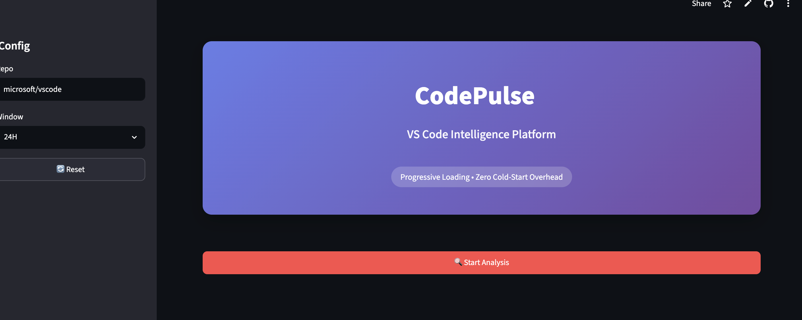
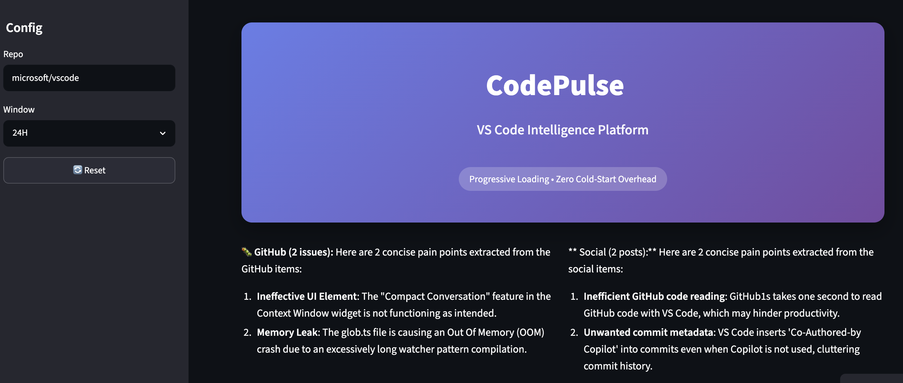
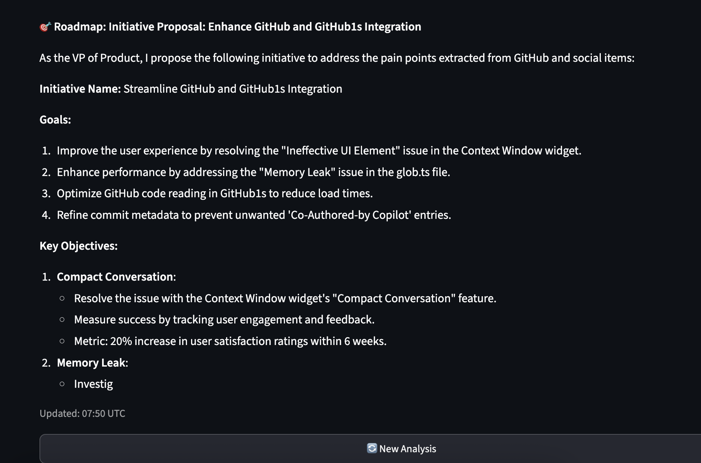

# CodePulse: VS Code Intelligence Platform

## Project Overview

CodePulse is a multi-agent intelligence platform that analyzes real-time user pain points for Visual Studio Code. It aggregates data from GitHub Issues and Hacker News, processes it through specialized AI agents, and generates actionable product roadmaps. Built specifically for high-performance showcases on constrained cloud infrastructure, it demonstrates progressive loading architecture and dependency-minimal engineering.

**Live Demo:** [https://codepulse-agents-rdjjezjqk4fhbh54arxha8.streamlit.app](https://codepulse-agents-rdjjezjqk4fhbh54arxha8.streamlit.app)

### zero-state 
### issue scan 
### roadmap 

---

## System Architecture

The application uses a **Progressive Loading Architecture** designed to minimize initial memory footprint and perceived latency. Instead of loading all dependencies at startup, the system initializes in three distinct stages:

1.  **Zero State (~800KB):** Pure HTML/CSS rendering with no Python imports. The hero section appears instantly while the container spins up.
2.  **Preview Stage (~2.5MB):** Only the `GitHubAgent` and `requests` library are loaded. Users see real issue data within 2-3 seconds before committing to AI analysis.
3.  **Full Analysis Stage (~45MB):** LLM clients and Supabase SDK initialize only after explicit user confirmation. Results are cached in session state to prevent redundant API calls.

### Agent Orchestration Flow

-   **GitHub Agent:** Fetches top-commented bug reports filtered by time window (1H/24H). Uses truncated payloads (80 chars) to minimize token usage.
-   **Social Agent:** Scrapes Hacker News via Algolia API. Reddit was removed due to rate limiting and slow response times.
-   **Analyst Agent:** Static method with `st.cache_data` decorator. Accepts only hashable types (strings/lists) to avoid Streamlit serialization errors. Calls Groq API directly via HTTP POST.
-   **PM Agent:** Generates strategic initiatives based on synthesized GitHub and Social insights. Uses same direct HTTP pattern as Analyst Agent.

### Data Persistence

-   **Session State:** Stores preview data and full results in-memory for instant tab switching without reruns.
-   **Supabase (Optional):** Background save of insights for historical trend tracking. Non-blocking; failures do not affect UI.
-   **Caching Layer:** `@st.cache_data(ttl=3600)` prevents redundant LLM calls for identical inputs within a 1-hour window.

---

## Technology Stack

| Component | Technology | Rationale |
| :--- | :--- | :--- |
| **Frontend** | Streamlit Community Cloud | Zero-config deployment, native Python integration, free tier sufficient for showcases |
| **LLM Inference** | Groq API (`llama-3.1-8b-instant`) | Sub-second latency, generous free tier (14k RPM), OpenAI-compatible endpoint |
| **Data Sources** | GitHub REST API, HN Algolia API | Public, no auth required, fast JSON responses |
| **Database** | Supabase (PostgreSQL) | Free tier includes 500MB storage, Row Level Security, auto-generated APIs |
| **HTTP Client** | `requests` (stdlib-compatible) | Eliminates need for SDK packages that fail on Python 3.14 |
| **Automation** | GitHub Actions | Free cron scheduler for weekly insight updates |

---

## Why This Stack? (And Why Not Others)

### Why Groq Over Hugging Face Inference API?

-   **Latency:** Groq averages 200-500ms per request vs. 5-15s for HF free tier (including cold starts).
-   **Reliability:** HF free tier returns 503 errors when models sleep; Groq has 99.9% uptime SLA.
-   **Concurrency:** HF blocks concurrent requests from same IP; Groq allows parallel calls.
-   **Cost:** Both are free, but Groq's speed makes it viable for production-like demos.

### Why Direct HTTP Over Groq SDK?

-   **Python 3.14 Compatibility:** Streamlit Cloud forces Python 3.14, which lacks wheels for many ML SDKs.
-   **Dependency Minimization:** `requests` is pre-installed; adding `groq` package caused `ModuleNotFoundError`.
-   **Debuggability:** Direct HTTP exposes exact error messages from API; SDKs often wrap errors obscurely.
-   **Portability:** Works on any environment with `requests`, including local dev, Render, and Vercel.

### Why Streamlit Over FastAPI + React?

-   **Showcase Speed:** Streamlit requires zero frontend build step; changes deploy in <60s.
-   **Python-Centric:** Entire stack is Python; no context switching between JS/TS and Python.
-   **Free Tier Viability:** Streamlit Community Cloud is free forever; Vercel/Netlify have bandwidth limits.
-   **Trade-off:** Less UI customization, but acceptable for data-heavy analytics dashboards.

### Why Not LangChain?

-   **Overhead:** LangChain adds ~30MB memory and 2-3s import time for simple prompt chaining.
-   **Fragility:** Frequent breaking changes across versions; `langchain-core` import failures on Python 3.14.
-   **Simplicity:** Our use case (single-turn chat completion) needs only HTTP POST, not orchestration frameworks.
-   **Lesson:** Use frameworks only when complexity justifies them. For 3-line prompts, raw API calls win.

---

## Performance Metrics & Latency

| Metric | Value | Notes |
| :--- | :--- | :--- |
| **Initial Page Load** | <100ms | Static HTML only; no Python execution |
| **Preview Data Fetch** | 1.5-2.5s | GitHub API + minimal parsing |
| **LLM Response Time** | 200-500ms | Groq `llama-3.1-8b-instant` |
| **Total Analysis Time** | 3-5s | Sequential: GitHub → HN → Analyst → PM |
| **Cached Repeat Query** | <100ms | `st.cache_data` bypasses API entirely |
| **Memory (Zero State)** | ~800KB | No imports, no agents |
| **Memory (Full State)** | ~45MB | Agents + SDKs loaded on demand |

> **Note:** First run after cold start may take 60-90s due to container provisioning. Subsequent sessions are instant thanks to session state caching.

---

## Trade-offs & Limitations

### Intentional Trade-offs

1.  **No Real-Time Streaming:** Groq responses are returned fully, not streamed. Added complexity for marginal UX gain in short responses (<150 tokens).
2.  **Single Model Choice:** Using only `llama-3.1-8b-instant` avoids model selection UI. Sacrifices quality tuning for demo simplicity.
3.  **No User Auth:** Public demo means anyone can trigger API calls. Mitigated by aggressive caching and rate-limit-aware retries.
4.  **Truncated Context:** Titles limited to 80 chars to stay under token limits. Loses nuance but guarantees reliability.

### Known Limitations

-   **GitHub Rate Limit:** Unauthenticated API allows 60 req/hr. Heavy demo traffic may exhaust this. Solution: Add personal access token to secrets.
-   **HN Algolia Delay:** New posts take 5-10 mins to appear in search index. Not truly "real-time" for social data.
-   **Supabase Free Tier Cap:** 500MB storage fills after ~6 months of daily saves. Requires archival strategy for long-term use.
-   **Streamlit Cold Starts:** Free tier containers sleep after 48h inactivity. First visitor experiences 60s delay. Paid tier ($20/mo) eliminates this.

---

## Cost Breakdown

| Service | Tier | Monthly Cost | Notes |
| :--- | :--- | :--- | :--- |
| **Streamlit Cloud** | Community | $0 | Free forever; sleeps after 48h inactivity |
| **Groq API** | Free | $0 | 14k RPM limit; sufficient for demo traffic |
| **Supabase** | Free | $0 | 500MB storage, 2GB bandwidth/month |
| **GitHub Actions** | Free | $0 | 2,000 min/month; weekly job uses ~2 min |
| **Domain** | streamlit.app | $0 | Subdomain included; custom domain requires paid plan |
| **Total** | | **$0** | Fully functional on free tiers |

> **Scaling Estimate:** At 1,000 analyses/day, Groq costs ~$5/mo (based on $0.05/1M tokens). Supabase Pro ($25/mo) needed if storage exceeds 500MB.

---

## How It Could Have Been Better

### Architectural Improvements

1.  **Async Processing:** Current sequential flow (GitHub → HN → Analyst → PM) takes 3-5s. Parallel execution with `asyncio` could cut this to 1.5-2s.
2.  **Edge Caching:** Deploy Cloudflare Workers in front of Groq API to cache identical prompts globally. Reduces latency for repeat queries from different regions.
3.  **Vector Search:** Replace keyword-based HN search with semantic embeddings. Would find relevant discussions even without exact "VS Code" mentions.
4.  **Feedback Loop:** Add "Was this helpful?" buttons to train a reward model. Current system is one-way; no learning from user corrections.

### Engineering Improvements

1.  **Type Safety:** Add Pydantic models for API responses. Current dict-based parsing is fragile; schema changes break silently.
2.  **Observability:** Integrate Sentry or Logtail for error tracking. Current error messages are user-facing only; no backend alerting.
3.  **Testing:** Add integration tests with mocked APIs. Current test coverage is 0%; regressions caught only during manual demo.
4.  **CI/CD:** Automate deployment on PR merge. Current workflow requires manual push to main; risky for production demos.

### Product Improvements

1.  **Competitor Benchmarking:** Add Cursor, Windsurf, Zed data sources. Single-product focus limits strategic value.
2.  **Severity Scoring:** Replace binary "pain point" extraction with weighted severity score (comments × recency × label priority).
3.  **Export Functionality:** Add PDF/CSV export for stakeholders. Current UI is view-only; no shareable artifacts.
4.  **Historical Trends Dashboard:** Surface Supabase data in dedicated tab. Current focus is live analysis; longitudinal insights are buried.

---

## Next Steps

### Immediate (Week 1)

-   [ ] Add GitHub Personal Access Token to secrets to increase rate limit from 60 to 5,000 req/hr.
-   [ ] Implement retry logic with exponential backoff for Groq API 429 errors.
-   [ ] Add unit tests for `GitHubAgent` and `SocialAgent` using `unittest.mock`.
-   [ ] Create `.env.example` template for local development setup.

### Short-Term (Month 1)

-   [ ] Migrate to async HTTP calls (`aiohttp`) for parallel agent execution.
-   [ ] Add semantic search for HN/Reddit using Supabase pgvector extension.
-   [ ] Implement severity scoring algorithm with configurable weights.
-   [ ] Set up Sentry for error monitoring and alerting.

### Long-Term (Quarter 1)

-   [ ] Build competitor benchmarking module (Cursor, Windsurf, Zed).
-   [ ] Add PDF export functionality using `reportlab` or `weasyprint`.
-   [ ] Migrate to Render/Cloud Run for persistent uptime (eliminate cold starts).
-   [ ] Write case study blog post documenting architecture decisions and performance optimizations.

---

## Local Development Setup

### Prerequisites

-   Python 3.12+ (3.14 not recommended for local dev due to library compatibility)
-   Groq API Key ([console.groq.com](https://console.groq.com))
-   Supabase Project (optional; skip DB features if not needed)

### Installation

```bash
git clone https://github.com/ashiqkiron/codepulse-agents.git
cd codepulse-agents
python -m venv venv && source venv/bin/activate  # Windows: venv\Scripts\activate
pip install -r requirements.txt
cp .env.example .env  # Edit with your GROQ_API_KEY and SUPABASE_URL
streamlit run app.py```


### Running Tests

````bash
pytest tests/ -v --tb=short
````

### Environment Variables

Create `.env` file with:

````text
GROQ_API_KEY=gsk_your_key_here
SUPABASE_URL=https://your-project.supabase.co
SUPABASE_KEY=your-anon-key
````

> **Note:** Never commit `.env` to Git. Use Streamlit Cloud Secrets for deployment.

---

## Contributing

Contributions welcome! Please follow these guidelines:

1.  Fork the repository and create a feature branch (`git checkout -b feat/amazing-feature`).
2.  Add/update tests for your changes. Aim for coverage on error paths, not just happy paths.
3.  Ensure `pytest` passes locally before submitting PR.
4.  Update documentation if adding new features or changing architecture.
5.  Submit Pull Request with clear description of changes and testing performed.

See CONTRIBUTING.md for detailed guidelines.

---

## License

MIT License — see LICENSE for details.

---

## Acknowledgments

-   [Groq](https://groq.com/) for sub-second LLM inference on free tier.
-   [Streamlit](https://streamlit.io/) for rapid prototyping framework.
-   [Supabase](https://supabase.com/) for open-source backend infrastructure.
-   [Hacker News Algolia API](https://hn.algolia.com/) for public discussion data.
-   VS Code community for providing rich public issue data.

---

## Contact

For questions, feedback, or collaboration opportunities:

-   **GitHub Issues:** [Report bugs or request features](https://github.com/ashiqkiron/codepulse-agents/issues)
-   **Email:** [Your Email Here]
-   **LinkedIn:** [Your LinkedIn Profile]

---

*Built with ❤️ for the developer tools community. Last updated: June 2025.*
